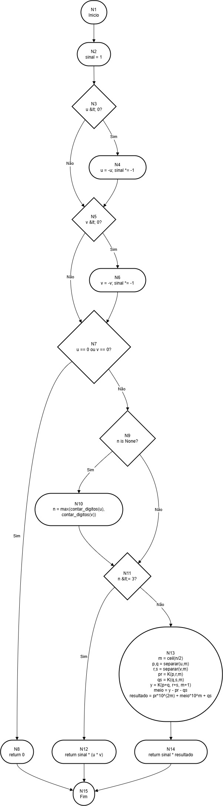

# Karatsuba – Multiplicação Rápida de Inteiros

## Descrição do projeto

Este projeto implementa a multiplicação de inteiros utilizando o **algoritmo de Karatsuba**, um método recursivo que reduz o número de multiplicações necessárias quando comparamos com a multiplicação padrão.  

A ideia central é dividir cada número em **duas metades** (parte alta e baixa) e calcular o produto com **apenas 3 multiplicações recursivas**, explorando a identidade:

- Seja `u = p * 10^m + q` e `v = r * 10^m + s`.
- Computamos:
  - `pr = p * r`
  - `qs = q * s`
  - `y = (p + q) * (r + s)`
- Então:
`u * v = pr * 10^(2m) + (y - pr - qs) * 10^m + qs`


## Passo a passo das funções (foco em `karatsuba`)

### `contar_digitos(n)`

- `if n == 0: return 1` → por convenção, zero tem 1 dígito.  
- enquanto `n > 0`: divide por 10 acumulando `cont`.  
- retorna o total de dígitos.

---

### `separar_em_altobaixo(numero, m)`

- `base = 10 ** m` → define o divisor.  
- `alto = numero // base` → parte alta (quociente).  
- `baixo = numero % base` → parte baixa (resto).  
- retorna `(alto, baixo)`.

---

### `karatsuba(u, v, n=None)`

1. `sinal = 1` → iniciamos assumindo resultado positivo.  
2. `if u < 0: u = -u; sinal *= -1` → normaliza `u` (guarda sinal).  
3. `if v < 0: v = -v; sinal *= -1` → normaliza `v`.  
4. `if u == 0 or v == 0: return 0` → produto nulo, retorno rápido.  
5. `if n is None: n = max(contar_digitos(u), contar_digitos(v))` → define nº de dígitos relevante.  
6. `if n <= 3: return sinal * (u * v)` → **caso-base**: números pequenos multiplicam direto.  
7. `m = (n + 1) // 2` → \( m = \lceil n/2 \rceil \).  
8. `p, q = separar_em_altobaixo(u, m)` → `u = p*10^m + q`.  
9. `r, s = separar_em_altobaixo(v, m)` → `v = r*10^m + s`.  
10. `pr = karatsuba(p, r, m)` → subproduto das partes altas.  
11. `qs = karatsuba(q, s, m)` → subproduto das partes baixas.  
12. `y = karatsuba(p + q, r + s, m + 1)` → produto das somas (pode “crescer” um dígito → `m+1`).  
13. `meio = y - pr - qs` → termo cruzado (identidade de Karatsuba).  
14. `resultado = pr * 10^(2m) + meio * 10^m + qs` → recomposição final.  
15. `return sinal * resultado` → restaura o sinal original.  


## ▶️ Como executar o projeto

### Requisitos
- **Python 3.10+** (recomendado)  
- Nenhuma dependência externa  

### Passos

```bash
# 1) Clone o repositório
git clone https://github.com/isaac-portela/puc-minas-fundamentos-projeto-analise-algoritimos.git
cd algoritimo-karatsuba

# 2) (Opcional) Crie e ative um ambiente virtual
python -m venv .venv
# Windows:
.venv\Scripts\activate
# Linux/Mac:
source .venv/bin/activate

# 3) Execute o script
python main.py

```

# Lista 2 – Gabarito  
## Complexidade Ciclomática – Função `karatsuba(u, v, n=None)`

---

## I. Representação da função em fluxo de controle

**Passos do fluxo de controle:**

1. Início da função.  
2. Inicialização do sinal: `sinal = 1`.  
3. Decisão: `u < 0?`  
   - **Verdadeiro**: `u = -u` e `sinal *= -1`.  
   - **Falso**: segue adiante.  
4. Decisão: `v < 0?`  
   - **Verdadeiro**: `v = -v` e `sinal *= -1`.  
   - **Falso**: segue adiante.  
5. Decisão: `u == 0 or v == 0?`  
   - **Verdadeiro**: `return 0`.  
   - **Falso**: segue adiante.  
6. Decisão: `n is None?`  
   - **Verdadeiro**: `n = max(contar_digitos(u), contar_digitos(v))`.  
   - **Falso**: segue adiante.  
7. Decisão: `n <= 3?` (caso-base)  
   - **Verdadeiro**: `return sinal * (u * v)`.  
   - **Falso**: segue adiante.  
8. **Caso geral (recursivo):**  
   - `m = ceil(n/2)`; separa `u` em `(p, q)` e `v` em `(r, s)`.  
   - Três chamadas recursivas: `pr = karatsuba(p, r, m)`, `qs = karatsuba(q, s, m)`, `y = karatsuba(p+q, r+s, m+1)`.  
   - Combina: `meio = y - pr - qs` e `resultado = pr*10^(2m) + meio*10^m + qs`.  
9. `return sinal * resultado`.


---

## II. Estruturando o grafo de fluxo

> **Modelagem**: Foi incluido um nó explícito de **Fim** para convergir os múltiplos `return`.

### Nós (𝑁)

1. **N1**: Início  
2. **N2**: `sinal = 1`  
3. **N3**: decisão `u < 0?`  
4. **N4**: ajuste de `u` e `sinal`  
5. **N5**: decisão `v < 0?`  
6. **N6**: ajuste de `v` e `sinal`  
7. **N7**: decisão `u == 0 or v == 0?`  
8. **N8**: `return 0`  
9. **N9**: decisão `n is None?`  
10. **N10**: `n = max(...)`  
11. **N11**: decisão `n <= 3?`  
12. **N12**: `return sinal * (u * v)`  
13. **N13**: bloco recursivo (cálculo de `m`, separações, 3 recursões, combinação)  
14. **N14**: `return sinal * resultado`  
15. **N15**: **Fim**

**Total de nós:** 𝑁 = **15**

### Arestas (𝐸)

1. N1→N2  
2. N2→N3  
3. N3→N4 (V)  
4. N3→N5 (F)  
5. N4→N5  
6. N5→N6 (V)  
7. N5→N7 (F)  
8. N6→N7  
9. N7→N8 (V)  
10. N7→N9 (F)  
11. N8→N15  
12. N9→N10 (V)  
13. N9→N11 (F)  
14. N10→N11  
15. N11→N12 (V)  
16. N11→N13 (F)  
17. N12→N15  
18. N13→N14  
19. N14→N15

**Total de arestas:** 𝐸 = **19**  
**Componentes conexos:** 𝑃 = **1**

---

## III. Complexidade ciclomática

**M = E − N + 2P = 19 − 15 + 2×1 = 6**

---

## IV. Interpretação do valor obtido

- **M = 6** indica **seis caminhos linearmente independentes** no código.  
- A função possui poucos ramos (`if`), e a **recursão não aumenta M**; ela reutiliza os mesmos ramos em níveis inferiores.  
- Para **cobertura de testes**, recomenda-se projetar **≥ 6 casos** que percorram um conjunto base de caminhos independentes.

---
## Análise da complexidade assintótica – Karatsuba

> **Notação:** considere `n` como o **nº de dígitos** (base 10) dos operandos  
> (equivalentemente, o nº de bits em outra base muda apenas constantes).

---

### 1) Complexidade **Temporal** `T(n)`

**Recorrência do Karatsuba:**T(n) = 3 · T(⌈n/2⌉) + O(n)
- Os termos `+ O(n)` vêm das somas/subtrações/splits/“shifts” (multiplicar por 10^m).
- A parte dominante são as **3 multiplicações recursivas**.

**Solução (Teorema Mestre):**


**Observações práticas:**
- Para `n` pequeno (ex.: `n ≤ 3` no seu código), cai no **caso-base O(1)**.
- Em geral, **não há diferença entre melhor/médio/pior** caso para entradas de mesmo tamanho — a estrutura do algoritmo não depende dos dígitos específicos (exceto retornos triviais como `u == 0 or v == 0`).

---

### 2) Complexidade **Espacial** `S(n)`

- **Pilha de recursão:** profundidade ≈ `⌈log2 n⌉` → `O(log n)`.
- **Temporários por chamada:** inteiros de até `O(n)` dígitos (`p,q,r,s`, `pr,qs,y`, etc.).  
  Apesar de existirem até 3 produtos parciais ao mesmo tempo, isso é **constante em quantidade**, cada um com tamanho `O(n)` no nível superior.  
- **Espaço auxiliar total:** `O(n)` (dominado pelo maior inteiro temporário) + `O(log n)` da pilha → **`O(n)`**.

> Contando também os próprios operandos de entrada, o espaço total ainda é linear no tamanho dos dados.

---

### 3) Tabela de casos (tempo e espaço)

| Caso          | Tempo                          | Espaço |
|---------------|--------------------------------|--------|
| **Melhor**    | `O(1)` se `n ≤ limiar` (caso-base) ; caso assintótico: `Θ(n^{1,585})` | `O(n)` |
| **Médio**     | `Θ(n^{1,585})`                 | `O(n)` |
| **Pior**      | `Θ(n^{1,585})`                 | `O(n)` |


---


### 4) Diagrama de Fluxo


