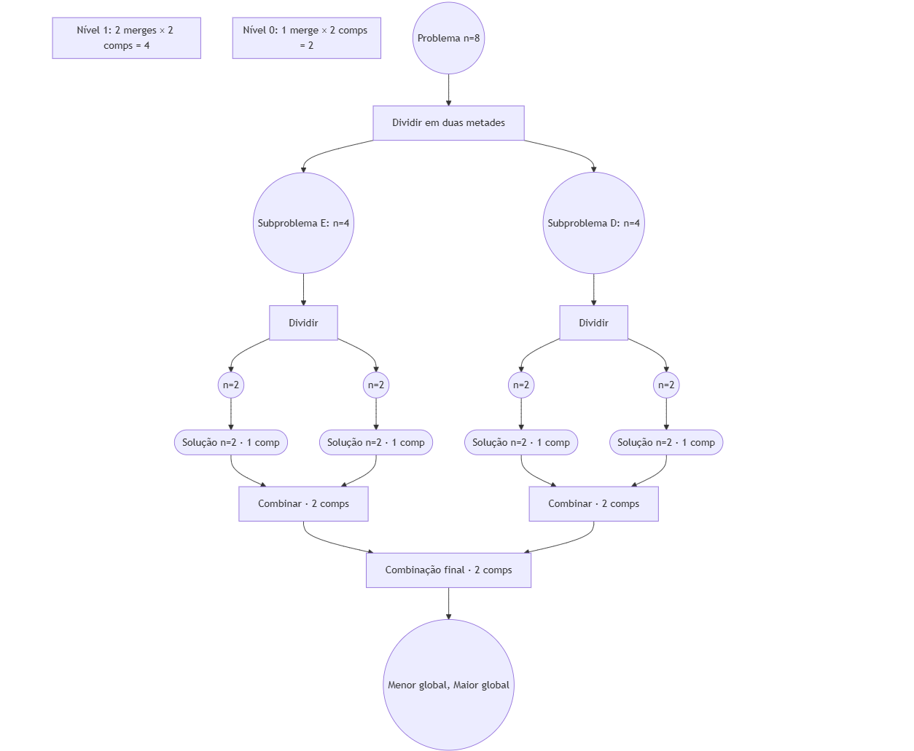

# MaxMin Select (Divisão e Conquista) — Python

> Seleção simultânea do **menor** e do **maior** elemento de uma sequência, com **número mínimo de comparações**.

---

## 📌 Descrição do projeto

Este projeto implementa, em `main.py`, o algoritmo **MaxMin Select** por **divisão e conquista**. A estratégia é:
1. **Dividir** a sequência ao meio;
2. **Resolver recursivamente** cada metade (obtendo menor e maior de cada subproblema);
3. **Combinar** os resultados com **apenas 2 comparações** (uma para o mínimo global e outra para o máximo global).

Essa abordagem reduz o número total de comparações em relação à solução ingênua (`2(n-1)`), atingindo, no caso ideal (quando `n` é potência de 2), **`3n/2 - 2`** comparações — que é assintoticamente **Θ(n)**.

---

## 🗂 Estrutura do repositório

```
.
├── main.py
└── assets/
    └── maxmin_recursion_tree.png   # Diagrama da recursão e das comparações por nível
```

---

## ▶️ Como executar o projeto (ambiente local)

### Requisitos
- Python 3.8+

### Passos
```bash
# 1) (opcional) criar e ativar venv
python -m venv .venv
# Linux/Mac
source .venv/bin/activate
# Windows (PowerShell)
.venv\Scripts\Activate.ps1

# 2) Executar
python main.py
```

A saída mostrará uma **demonstração** com:
- menor e maior da lista de exemplo,
- **contador** de comparações,
- e comparação com a variante **pairwise** (em pares).

---

## 🧠 Lógica do algoritmo (linha a linha)

A implementação principal está em `maxmin_divide_and_conquer(arr)`:

```py
if n == 0: raise ValueError(...)       # não há min/max de lista vazia
if n == 1: return (x, x, 0)            # 0 comparações
if n == 2:                             
    # 1 comparação para decidir quem é min e quem é max
    return (min(x,y), max(x,y), 1)
```

Para `n > 2` (passos centrais):
```py
mid = n // 2
minL, maxL, cL = maxmin_divide_and_conquer(arr[:mid])    # resolve esquerda
minR, maxR, cR = maxmin_divide_and_conquer(arr[mid:])    # resolve direita

# Combinação com exatamente 2 comparações
if minL < minR:       # 1ª comparação     -> minG = min(minL, minR)
    minG = minL
else:
    minG = minR

if maxL > maxR:       # 2ª comparação     -> maxG = max(maxL, maxR)
    maxG = maxL
else:
    maxG = maxR

return minG, maxG, cL + cR + 2
```

**Por que 2 comparações na combinação?**  
Os subproblemas já retornam os pares `(min, max)`. Para compor a resposta global, basta:
- comparar os **mínimos locais** para obter o **mínimo global** (1 comparação),
- comparar os **máximos locais** para obter o **máximo global** (1 comparação).

Total no *merge*: **2** comparações, independentemente do tamanho dos subarrays.

---

##  Relatório técnico — Análise de complexidade

## Contagem de comparações — MaxMin Select
**Casos base**
- `T(1) = 0` → com 1 elemento, ele é min e max.
- `T(2) = 1` → 1 comparação decide quem é min e quem é max.

**Para n > 2**  
Dividimos o vetor em duas metades e, na combinação (merge), fazemos **2 comparações**
(uma para o min global e outra para o max global):
T(n) = T(floor(n/2)) + T(ceil(n/2)) + 2

**Quando n é potência de 2 (n = 2^k)**  
A recorrência simplifica para: T(n) = 2 * T(n/2) + 2 com T(2) = 1
**Expansão até a base**
T(n) = 2^(k-1) * T(2) + 2 * (2^(k-1) - 1)
T(n) = (n/2) * 1 + 2 * (n/2 - 1)
T(n) = 3n/2 - 2


**Resumo**
- Número de comparações ≈ `3n/2 - 2` (quando n é potência de 2).
- Para n geral (ímpares ou não-potências de 2), o custo continua **linear**: `Theta(n)`.

> Comparando: a versão “ingênua” (duas varreduras) faz `2(n - 1)` comparações.  
> As versões *pairwise* e *divide-and-conquer* ficam em torno de `1,5n`.

---

## Teorema Mestre — MaxMin Select (sem LaTeX)

**Forma padrão da recorrência:**
T(n) = a * T(n/b) + f(n)

**Para este algoritmo:**
a = 2
b = 2
f(n) = constante (O(1))


**Cálculo e comparação de ordens**
- `log_b(a) = log_2(2) = 1`
- `f(n) = O(1)` cresce mais devagar do que `n^1` (ou seja, é menor do que `n`)

**Conclusão (Caso 1 do Teorema Mestre):**
T(n) = O(n)

**Coerência com a conta exata (caso ideal):**

T(n) = 2 * T(n/2) + 2, T(2) = 1 => T(n) = 3n/2 - 2
---


## 🖼 Diagrama da recursão 

O arquivo `assets/maxmin_recursion_tree.png` ilustra a **árvore de recursão** para `n = 8` elementos, mostrando:
- Divisões por nível (cada nó é um subproblema);
- **2 comparações** em cada *merge* (nó interno);
- Total por nível e soma ao longo dos níveis.


)

---

## ✍ Referências didáticas (materiais do professor)

- *AULA 01 — Análise de complexidade de algoritmos.pdf*  
- Pasta de PDFs: repositório de apoio do professor


---

## 📎 Licença

Este projeto é de uso educacional.
